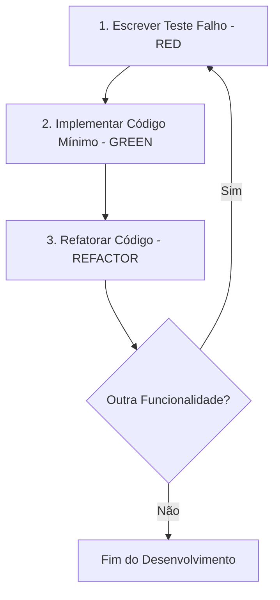

# Plano de Testes — Gratia Localiza (Foco em TDD First)

Este documento define a estratégia, a arquitetura e os cenários de teste automatizados para o **Sistema de Atendimento Gratia Localiza**. Alinhado com a metodologia **TDD (Test-Driven Development)**, os testes aqui propostos devem ser escritos *antes* da implementação das funcionalidades correspondentes, atuando como a especificação executável do comportamento do sistema.

---

## 1. Filosofia e Ciclo TDD (Red-Green-Refactor)

O desenvolvimento de cada funcionalidade do sistema deve seguir estritamente o ciclo TDD:



1. **RED (Escrever o Teste)**: Escrever o teste unitário ou de integração com base nos requisitos detalhados na especificação. A execução inicial do teste deve falhar (por ausência do código ou lógica).
2. **GREEN (Fazer Passar)**: Implementar a menor quantidade de código possível para fazer o teste passar. Não focar em otimizações ou design elegante neste momento, apenas na correção funcional.
3. **REFACTOR (Refatorar)**: Limpar o código, eliminar duplicidades, melhorar nomenclatura e estrutura de controle de fluxo, garantindo que a suíte de testes permaneça **verde** (sem regressões).

---

## 2. Estrutura do Ambiente de Testes

Utilizaremos o framework **pytest** devido à sua extensibilidade, sintaxe limpa baseada em `assert` e suporte robusto a fixtures. As dependências necessárias foram adicionadas ao `requirements.txt`:
* `pytest`: Executor e framework de testes.
* `pytest-mock`: Integração simplificada para mockar funções e objetos via `unittest.mock`.

### 2.1. Arquitetura do Diretório de Testes
Os testes serão estruturados no diretório `tests/` para espelhar a estrutura do diretório `app/` no backend:

```text
backend/
├── app/
│   ├── models.py
│   ├── routes/
│   │   ├── auth.py
│   │   ├── customer.py
│   │   ├── attendant.py
│   │   └── admin.py
│   └── utils/
│       └── decorators.py
└── tests/
    ├── conftest.py          # Fixtures globais (app, db, client, auth)
    ├── test_models.py       # Testes unitários de modelos e relacionamentos
    ├── test_auth.py         # Testes de autenticação e registro
    ├── test_customer.py     # Testes do painel do cliente
    ├── test_attendant.py    # Testes do painel do atendente
    ├── test_admin.py        # Testes de administração e relatórios
    └── test_decorators.py   # Testes dos decoradores de acesso
```

---

## 3. Configuração de Fixtures Globais (`conftest.py`)

Para evitar duplicação de código de configuração e garantir o isolamento entre os testes, o arquivo [conftest.py](file:///home/gabriel-sousa/Documents/gratia-localiza/backend/tests/conftest.py) definirá as fixtures fundamentais do banco de dados e do cliente de testes Flask.

```python
import pytest
from app import create_app, db
from app.models import User

@pytest.fixture
def app():
    """Cria e configura uma instância da aplicação para cada teste."""
    app = create_app({
        'TESTING': True,
        'SQLALCHEMY_DATABASE_URI': 'sqlite:///:memory:',  # DB em memória isolado
        'WTF_CSRF_ENABLED': False,                        # Desabilita CSRF para facilitar requisições de teste
        'SECRET_KEY': 'test_secret_key'
    })
    
    with app.app_context():
        db.create_all()
        yield app
        db.session.remove()
        db.drop_all()

@pytest.fixture
def client(app):
    """Retorna um cliente de teste do Flask."""
    return app.test_client()

@pytest.fixture
def runner(app):
    """Retorna um executor de CLI do Flask."""
    return app.test_cli_runner()

@pytest.fixture
def seed_users(app):
    """Insere usuários de teste com papéis distintos."""
    admin = User(nome="Admin Teste", email="admin@teste.com", papel="admin")
    admin.set_password("senha_admin") # Deve usar werkzeug.security se implementado
    
    atendente = User(nome="Atendente Teste", email="atendente@teste.com", papel="atendente")
    atendente.set_password("senha_atendente")
    
    cliente = User(nome="Cliente Teste", email="cliente@teste.com", papel="cliente")
    cliente.set_password("senha_cliente")
    
    db.session.add_all([admin, atendente, cliente])
    db.session.commit()
    
    return {
        "admin": admin,
        "atendente": atendente,
        "cliente": cliente
    }
```

---

## 4. Cenários de Teste por Módulo (Matriz de Cobertura)

Abaixo estão descritos os cenários críticos para cada funcionalidade exigida pela especificação técnica do sistema, acompanhados de seus respectivos esqueletos de código para o desenvolvimento TDD.

### Módulo 1: Modelagem e Configuração (`app/models.py`)

Foco em testar regras de banco de dados, integridade dos tipos de dados e os relacionamentos de cascata.

| Código Cenário | Funcionalidade | Cenário Crítico | Asserções Esperadas |
| :--- | :--- | :--- | :--- |
| **TEST-MOD-01** | Criação de Usuário | Validação de restrição de unicidade no campo `email`. | Lançamento de `IntegrityError` ao duplicar e-mail. |
| **TEST-MOD-02** | Relacionamento User/Ticket | Exclusão de usuário deve propagar ou gerenciar tickets órfãos (conforme design de domínio). | Acesso a `user.tickets` retorna lista de objetos correspondentes. |
| **TEST-MOD-03** | Relacionamento Ticket/Response | Cascata de remoção: excluir um ticket deve excluir suas respostas. | Ao apagar Ticket, Responses associadas são removidas automaticamente. |

#### Esqueleto TDD para `test_models.py`
```python
import pytest
from sqlalchemy.exc import IntegrityError
from app import db
from app.models import User, Ticket, Response

def test_user_email_uniqueness(app):
    """TDD RED: Valida que emails duplicados não são permitidos."""
    u1 = User(nome="User 1", email="dup@teste.com", papel="cliente")
    u2 = User(nome="User 2", email="dup@teste.com", papel="cliente")
    
    db.session.add(u1)
    db.session.commit()
    
    db.session.add(u2)
    with pytest.raises(IntegrityError):
        db.session.commit()

def test_ticket_response_cascade(app, seed_users):
    """TDD RED: Valida que a exclusão do ticket remove as respostas associadas."""
    cliente = seed_users["cliente"]
    atendente = seed_users["atendente"]
    
    ticket = Ticket(titulo="Erro no Login", descricao="Não consigo entrar", autor=cliente)
    db.session.add(ticket)
    db.session.commit()
    
    resp = Response(conteudo="Estamos analisando", ticket=ticket, user_id=atendente.id)
    db.session.add(resp)
    db.session.commit()
    
    # Exclusão do ticket
    db.session.delete(ticket)
    db.session.commit()
    
    assert Response.query.filter_by(id=resp.id).first() is None
```

---

### Módulo 2: Autenticação e Gestão de Acesso (`routes/auth.py`)

Foco no comportamento de login e cadastro público do cliente.

| Código Cenário | Funcionalidade | Cenário Crítico | Asserções Esperadas |
| :--- | :--- | :--- | :--- |
| **TEST-AUT-01** | Autocadastro de Cliente | Cadastro com e-mail já existente ou senha em branco. | Validação de formulário falha; mensagem de erro exposta. |
| **TEST-AUT-02** | Rota de Login | Redirecionamento correto conforme o papel (`papel`) do usuário logado. | Admin -> `/admin/attendants`, Atendente -> `/attendant/tickets`, Cliente -> `/customer/tickets`. |
| **TEST-AUT-03** | Credenciais Inválidas | Tentativa de login com senha incorreta ou usuário inexistente. | Resposta contém "Credenciais inválidas" e código HTTP 200 (re-renderiza login). |

#### Esqueleto TDD para `test_auth.py`
```python
def test_register_duplicate_email(client, seed_users):
    """TDD RED: Impede autocadastro de cliente com email em uso."""
    payload = {
        "nome": "Novo Cliente",
        "email": "cliente@teste.com",  # E-mail já semeado
        "password": "senha_segura"
    }
    response = client.post("/register", data=payload, follow_redirects=True)
    assert b"E-mail ja cadastrado" in response.data  # Mensagem de erro esperada no template

def test_login_redirect_by_role(client, seed_users):
    """TDD RED: Valida se o login redireciona para a rota correta baseada no papel."""
    roles_redirects = [
        ("admin@teste.com", "senha_admin", "/admin/attendants"),
        ("atendente@teste.com", "senha_atendente", "/attendant/tickets"),
        ("cliente@teste.com", "senha_cliente", "/customer/tickets")
    ]
    
    for email, senha, expected_redirect in roles_redirects:
        # Nota: Mockar login_user ou simular login completo
        response = client.post("/login", data={"email": email, "password": senha})
        assert response.status_code == 302
        assert response.headers["Location"].endswith(expected_redirect)
```

---

### Módulo 3: Módulo do Cliente (`routes/customer.py`)

Garante o isolamento dos dados do cliente. Um cliente **nunca** deve acessar tickets de outros clientes.

| Código Cenário | Funcionalidade | Cenário Crítico | Asserções Esperadas |
| :--- | :--- | :--- | :--- |
| **TEST-CLI-01** | Listagem de Tickets | Cliente só visualiza os tickets criados por ele mesmo. | Quantidade e IDs dos tickets na resposta pertencem unicamente ao `current_user.id`. |
| **TEST-CLI-02** | Criação de Ticket | Envio de formulário com dados válidos e nulos (título ou descrição vazios). | Sucesso: Redireciona para `/customer/tickets`. Falha: Permanece na página com erro de validação. |

#### Esqueleto TDD para `test_customer.py`
```python
from app.models import Ticket, User
from app import db

def test_customer_only_views_own_tickets(client, seed_users, mocker):
    """TDD RED: Garante que um cliente não pode ver tickets de outros."""
    cliente = seed_users["cliente"]
    outro_cliente = User(nome="Outro", email="outro@teste.com", papel="cliente")
    db.session.add(outro_cliente)
    db.session.commit()
    
    t1 = Ticket(titulo="Meu ticket", descricao="Problema A", autor=cliente)
    t2 = Ticket(titulo="Ticket alheio", descricao="Problema B", autor=outro_cliente)
    db.session.add_all([t1, t2])
    db.session.commit()
    
    # Mockando a autenticação do Flask-Login para retornar o cliente principal
    mocker.patch("flask_login.utils._get_user", return_value=cliente)
    
    response = client.get("/customer/tickets")
    assert response.status_code == 200
    assert b"Meu ticket" in response.data
    assert b"Ticket alheio" not in response.data
```

---

### Módulo 4: Módulo do Atendente (`routes/attendant.py`)

Valida as funções do painel de respostas e visualização de pendências.

| Código Cenário | Funcionalidade | Cenário Crítico | Asserções Esperadas |
| :--- | :--- | :--- | :--- |
| **TEST-ATE-01** | Visualizar Pendentes | Listar apenas tickets com `STATUS = "aberto"`. | Tickets com status "respondido" ou "fechado" não aparecem na listagem. |
| **TEST-ATE-02** | Responder Ticket | Atualizar o status do ticket para "respondido" de forma atômica ao salvar a resposta. | Estado do banco muda de status "aberto" para "respondido" e registra o `Response`. |

#### Esqueleto TDD para `test_attendant.py`
```python
from app.models import Ticket, Response
from app import db

def test_attendant_dashboard_only_shows_open_tickets(client, seed_users, mocker):
    """TDD RED: Dashboard do atendente deve exibir apenas tickets com status 'aberto'."""
    atendente = seed_users["atendente"]
    cliente = seed_users["cliente"]
    
    t_aberto = Ticket(titulo="Aberto", descricao="Texto", status="aberto", autor=cliente)
    t_respondido = Ticket(titulo="Respondido", descricao="Texto", status="respondido", autor=cliente)
    
    db.session.add_all([t_aberto, t_respondido])
    db.session.commit()
    
    mocker.patch("flask_login.utils._get_user", return_value=atendente)
    
    response = client.get("/attendant/tickets")
    assert response.status_code == 200
    assert b"Aberto" in response.data
    assert b"Respondido" not in response.data

def test_attendant_reply_updates_status(client, seed_users, mocker):
    """TDD RED: Enviar uma resposta altera o status do ticket para 'respondido'."""
    atendente = seed_users["atendente"]
    cliente = seed_users["cliente"]
    
    ticket = Ticket(titulo="Duvida", descricao="Onde clico?", status="aberto", autor=cliente)
    db.session.add(ticket)
    db.session.commit()
    
    mocker.patch("flask_login.utils._get_user", return_value=atendente)
    
    payload = {"conteudo": "Clique no botao azul na barra superior"}
    response = client.post(f"/attendant/ticket/{ticket.id}/reply", data=payload)
    
    assert response.status_code == 302  # Redireciona para o dashboard
    
    # Validações no Banco de Dados
    db.session.refresh(ticket)
    assert ticket.status == "respondido"
    assert len(ticket.respostas) == 1
    assert ticket.respostas[0].conteudo == "Clique no botao azul na barra superior"
```

---

### Módulo 5: Módulo do Administrador (`routes/admin.py`)

A área do administrador contém privilégios de criação de contas administrativas/atendentes e acesso a métricas de negócio.

| Código Cenário | Funcionalidade | Cenário Crítico | Asserções Esperadas |
| :--- | :--- | :--- | :--- |
| **TEST-ADM-01** | CRUD de Atendentes | Cadastro de atendente via painel do administrador. | Novo usuário inserido com `papel = "atendente"`. Senha é hasheada corretamente. |
| **TEST-ADM-02** | Relatórios Gerenciais | Geração das métricas de agregação por status e contagem de tickets. | Dados fornecidos ao contexto do template batem exatamente com as estatísticas do DB. |

#### Esqueleto TDD para `test_admin.py`
```python
from app.models import User, Ticket
from app import db

def test_admin_creates_attendant(client, seed_users, mocker):
    """TDD RED: Administrador consegue cadastrar um novo atendente com sucesso."""
    admin = seed_users["admin"]
    mocker.patch("flask_login.utils._get_user", return_value=admin)
    
    payload = {
        "nome": "Novo Atendente Contratado",
        "email": "novo_atendente@sistema.com",
        "password": "senha_segura_123"
    }
    
    response = client.post("/admin/attendants", data=payload)
    assert response.status_code == 200 # Renderiza a listagem atualizada
    
    novo_usuario = User.query.filter_by(email="novo_atendente@sistema.com").first()
    assert novo_usuario is not None
    assert novo_usuario.papel == "atendente"
    assert novo_usuario.check_password("senha_segura_123") is True

def test_admin_reports_aggregation(client, seed_users, mocker):
    """TDD RED: Valida que a rota de relatórios faz a agregação correta dos dados."""
    admin = seed_users["admin"]
    cliente = seed_users["cliente"]
    mocker.patch("flask_login.utils._get_user", return_value=admin)
    
    # Criando massa de teste controlada
    t1 = Ticket(titulo="T1", descricao="D1", status="aberto", autor=cliente)
    t2 = Ticket(titulo="T2", descricao="D2", status="respondido", autor=cliente)
    t3 = Ticket(titulo="T3", descricao="D3", status="respondido", autor=cliente)
    db.session.add_all([t1, t2, t3])
    db.session.commit()
    
    response = client.get("/admin/reports")
    assert response.status_code == 200
    # Verificação se o template apresenta os dados de contagem
    assert b"Total de Tickets: 3" in response.data or b"3" in response.data
    # Pode verificar se a resposta de contexto do template possui as chaves (necessita Flask test context)
```

---

### Módulo 6: Utilitários (`utils/decorators.py`)

Os decoradores controlam o acesso à nível de rota. Um erro de lógica aqui expõe dados confidenciais.

| Código Cenário | Funcionalidade | Cenário Crítico | Asserções Esperadas |
| :--- | :--- | :--- | :--- |
| **TEST-UTI-01** | Decorador `role_required` | Acesso negado para usuário logado com papel divergente do exigido. | Abortar requisição com código HTTP 403 (Acesso negado). |
| **TEST-UTI-02** | Decorador `role_required` | Acesso concedido para usuário com o papel correto. | Execução bem-sucedida do controlador (Status 200). |
| **TEST-UTI-03** | Decorador `role_required` | Acesso por usuário anônimo (não autenticado). | Redirecionamento para a página de login (Status 302). |

#### Esqueleto TDD para `test_decorators.py`
```python
from flask import Flask, abort
from app.utils.decorators import role_required
import pytest

def test_role_required_denies_unauthorized(app, seed_users, mocker):
    """TDD RED: Impede acesso de usuários com papéis incorretos."""
    cliente = seed_users["cliente"]
    mocker.patch("flask_login.utils._get_user", return_value=cliente)
    
    # Criar uma rota de teste mockada sob o contexto da aplicação
    @app.route("/rota_protegida_admin")
    @role_required("admin")
    def rota_protegida():
        return "Acesso concedido", 200
        
    client = app.test_client()
    response = client.get("/rota_protegida_admin")
    assert response.status_code == 403

def test_role_required_allows_authorized(app, seed_users, mocker):
    """TDD RED: Permite acesso para usuários com o papel correto."""
    admin = seed_users["admin"]
    mocker.patch("flask_login.utils._get_user", return_value=admin)
    
    @app.route("/rota_protegida_admin_permitida")
    @role_required("admin")
    def rota_protegida():
        return "Acesso concedido", 200
        
    client = app.test_client()
    response = client.get("/rota_protegida_admin_permitida")
    assert response.status_code == 200
    assert b"Acesso concedido" in response.data
```

---

## 5. Estratégia de Automação e Prevenção de Regressões

A estratégia baseia-se em manter a suíte de testes integrada ao fluxo diário de desenvolvimento, de maneira que qualquer regressão seja pega imediatamente.

### 5.1. Execução Local
A execução local deve ser simples e rápida. Os desenvolvedores rodarão a suíte de testes utilizando:

```bash
# Executa todos os testes unitários e de integração
pytest -v

# Executa testes com relatório de cobertura (coverage)
pytest --cov=app tests/
```

### 5.2. Automação via Docker (Ambiente Isolado)
Para garantir que o ambiente local do desenvolvedor não interfira no comportamento dos testes, podemos utilizar o próprio container Docker do projeto para rodar a suíte.

```bash
# Rodar os testes dentro do container sem alterar o banco de produção
docker-compose run --entrypoint "pytest -v" web
```

### 5.3. Integração Contínua (CI) — Github Actions
Recomenda-se a ativação de uma pipeline de CI para rodar os testes a cada *Push* ou *Pull Request* direcionado à branch `main` ou `develop`.

```yaml
# .github/workflows/tests.yml
name: Pipeline de Testes Automatizados

on:
  push:
    branches: [ main, develop ]
  pull_request:
    branches: [ main, develop ]

jobs:
  test:
    runs-on: ubuntu-latest
    
    steps:
    - uses: actions/checkout@v4
    
    - name: Configurar Python
      uses: actions/setup-python@v5
      with:
        python-node: '3.12'
        cache: 'pip'
        
    - name: Instalar Dependências
      run: |
        python -m pip install --upgrade pip
        pip install -r backend/requirements.txt
        
    - name: Executar Suite de Testes (pytest)
      env:
        FLASK_ENV: testing
        SECRET_KEY: test_github_actions_secret
        DATABASE_URL: sqlite:///:memory:
      run: |
        cd backend
        pytest -v --cov=app --cov-report=xml
        
    - name: Upload de Cobertura para Codecov
      uses: codecov/codecov-action@v4
      with:
        token: ${{ secrets.CODECOV_TOKEN }}
        file: ./backend/coverage.xml
```

> [!IMPORTANT]
> **Definição de Pronto (Definition of Done - DoD)**: Uma funcionalidade só é considerada finalizada quando seus respectivos testes passam com 100% de sucesso e a cobertura geral de código da funcionalidade atingir no mínimo **90%**.
